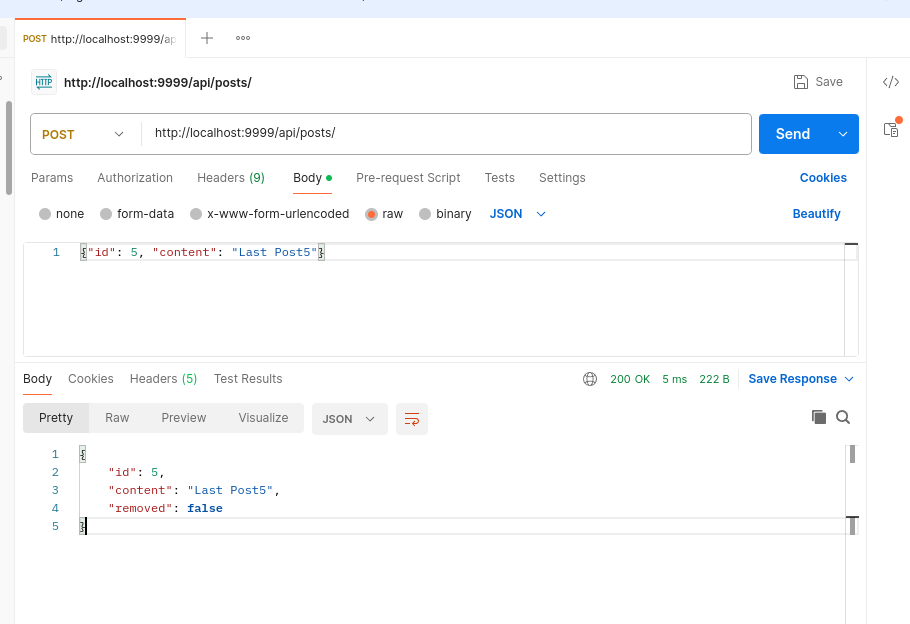
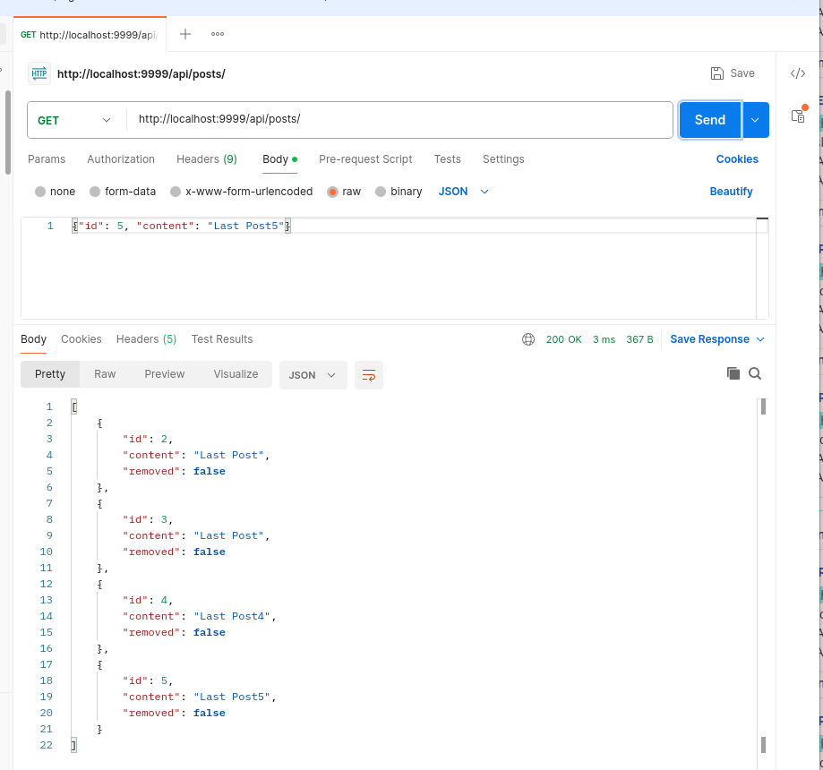
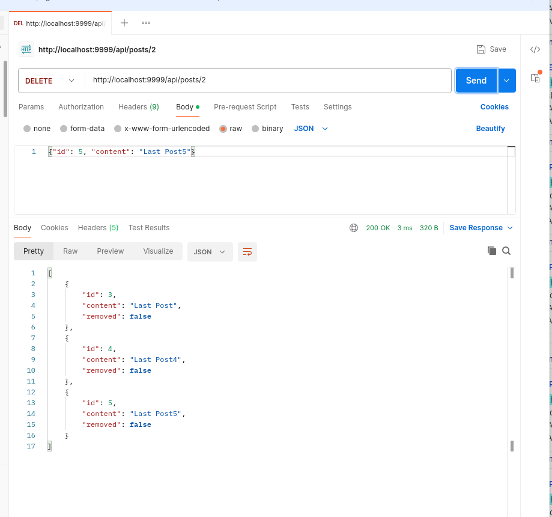
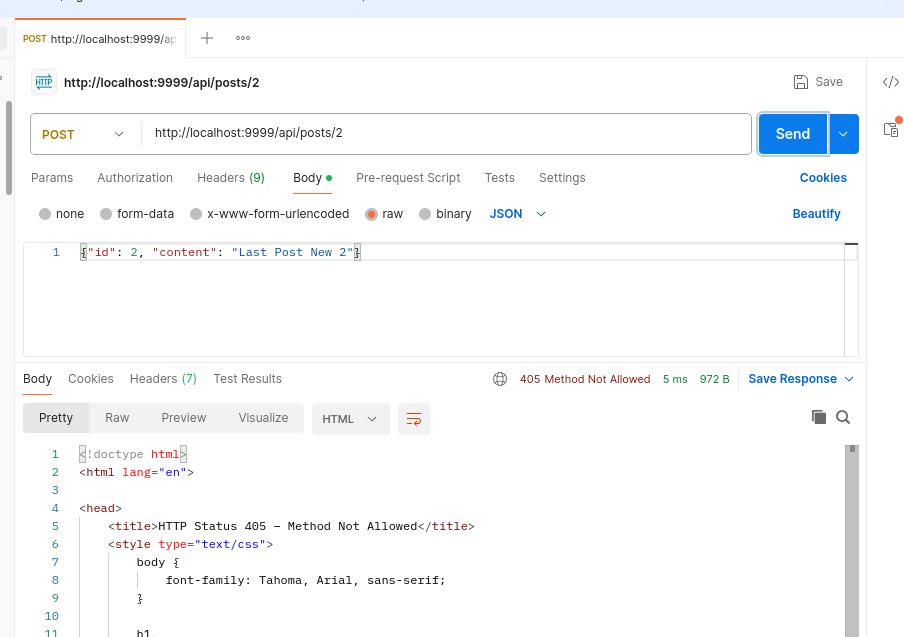

Локальное тетсирование 

Добавление 


показать всё



удаление 


попытка изменить удаленную запись 



Ловим ошибку в логах
```shell
SEVERE: Servlet.service() for servlet [app] in context with path [] threw exception [Request processing failed; nested exception is ru.netology.exception.NotFoundException] with root cause
ru.netology.exception.NotFoundException
	at java.base/java.util.Optional.orElseThrow(Optional.java:408)
```

Второй записи нет 
